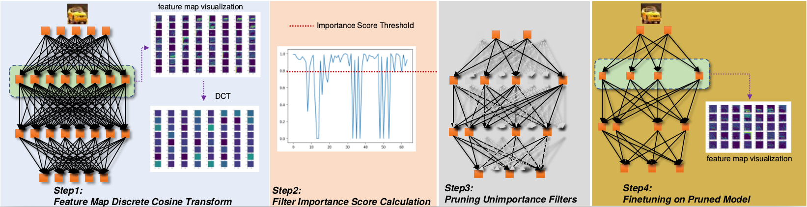

# Discrete Cosine Transform for Filter Pruning
This Repository mainly introduces a method of channel pruning using discrete cosine transform. Our paper [Discrete Cosine Transform for Filter Pruning](https://link.springer.com/article/10.1007/s10489-022-03604-2) has been accepted by [Applied Intelligence](https://www.springer.com/journal/10489). Part of the code is referenced from: [HRank: Filter Pruning using High-Rank Feature Map](https://github.com/lmbxmu/HRankPlus). Thanks for their great work before.

The following is the framework of this method:



The first step is to obtain the output feature maps of each filter of the model, and use the discrete cosine transform to transform the feature maps from the spatial domain to the frequency domain. The second step is to obtain the corresponding importance score according to the DCT coefficient of the feature maps. This importance score represents the relative importance of each channel in the filter. The third step is to remove some unimportant channels as needed based on the importance score. Finally, fine-tune the pruned model to restore the lost accuracy.

## Software dependency

The relevant software versions used in use are as follows:

- Ubuntu 16.04
- Python 3.5
- Pytorch 1.4.0
- CUDA 10.0

## Pre-trained Models
The pre-trained models used in our paper has been uploaded here:https://pan.baidu.com/s/1a1vUhsmdK_5GvGdfo5M1QQ 
code：mddg.
|Dateset|Models|
|:---:|:---:|
|Cifar10|VGG16|
|Cifar10|ResNet56|
|Cifar10|ResNet110|
|Cifar10|DensNet40|
|Cifar10|GoogleNet|
|ImageNet|ResNet50|
|DUTS|U<sup>2</sup>Net|

## Dataset

Datasets such as Cifar10, ImageNet, and DUTS are used in the experiment. Please store them in the following directory structure:

    DCT_Pruning/
    ├─data/
        ├─cifar-10-batches-py
        ├─ImageNet
        │    ├─ILSVRC2012_img_train
        │    └─val
        └─DUTS
            ├─DUTS-TE
            └─DUTS-TR

## Running Code

The use of this code is divided into two steps. First, the importance score of the model needs to be generated and saved locally, and then the importance score is used for pruning and fine-tuning.

### Generate importance score

```bash
python importance_generation.py \
--dataset [dataset name] \
--data_dir [dataset dir] \
--batch_size [batch size] \
--pretrain_dir [pretrain_model dir] \
--limit [batch numbers] \
--net [model name]
```

Among them, ‘--limit’ refers to the number of batches used to generate the importance score. A slightly larger setting will make the importance score more accurate. (We take 5 in the experiment)

### Network Pruning

According to the corresponding dataset, select the following code to prune the model. Note that different compression rates will significantly affect the final results of pruning. If the final accuracy after pruning cannot meet the requirements, please lower the compression rate appropriately.

The following are the compression ratios used in our experiment and the corresponding final results:

#### VGG-16

|Parameters,M(PR,%)|FLOPs,M(PR,%)|Top-1,%|
|:---:|:---:|:---:|
|0.87(94.2)|49.86(84.1)|92.81|

```bash
python prune_cifar10.py \
--dataset 'cifar10' \
--data_dir './data' \
--job_dir './save_models' \
--batch_size 256 \
--epochs 150 \
--snapshot 20 \
--learning_rate 0.01 \
--lr_decay_step '50,100' \
--momentum 0.9 \
--weight_decay 0.005 \
--pretrain_dir './checkpoints/vgg_16_bn.pt' \
--imp_score './importance_score/vgg_16_bn_limit5' \
--compress_rate '[0.50]*7+[0.95]*5' \
--net 'vgg_16_bn'
```

#### ResNet56

|Parameters,M(PR,%)|FLOPs,M(PR,%)|Top-1,%|
|:---:|:---:|:---:|
|0.66M(22.3%)|90.35M(28.0%)|93.96|

```bash
python prune_cifar10.py \
--dataset 'cifar10' \
--data_dir './data' \
--job_dir './save_models' \
--batch_size 256 \
--epochs 300 \
--snapshot 20 \
--learning_rate 0.01 \
--lr_decay_step '150,225' \
--momentum 0.9 \
--weight_decay 0.005 \
--pretrain_dir './checkpoints/resnet_56.pt' \
--imp_score './importance_score/resnet_56_limit5' \
--compress_rate '[0.]+[0.18]*29' \
--net 'resnet_56'
```

#### ResNet110

|Parameters,M(PR,%)|FLOPs,M(PR,%)|Top-1,%|
|:---:|:---:|:---:|
|1.00M(41.9%)|135.88M(46.3%)|94.26|

```bash
python prune_cifar10.py \
--dataset 'cifar10' \
--data_dir './data' \
--job_dir './save_models' \
--batch_size 256 \
--epochs 300 \
--snapshot 20 \
--learning_rate 0.01 \
--lr_decay_step '150,225' \
--momentum 0.9 \
--weight_decay 0.005 \
--pretrain_dir './checkpoints/resnet_110.pt' \
--imp_score './importance_score/resnet_110_limit5' \
--compress_rate '[0.]+[0.2]*2+[0.3]*18+[0.40]*18+[0.39]*19' \
--net 'resnet_110'
```

#### DensNet40

|Parameters,M(PR,%)|FLOPs,M(PR,%)|Top-1,%|
|:---:|:---:|:---:|
|0.62M(40.4%)|173.39M(38.5%)|94.32|

```bash
python prune_cifar10.py \
--dataset 'cifar10' \
--data_dir './data' \
--job_dir './save_models' \
--batch_size 256 \
--epochs 300 \
--snapshot 20 \
--learning_rate 0.01 \
--lr_decay_step '150,225' \
--momentum 0.9 \
--weight_decay 0.002 \
--pretrain_dir './checkpoints/densenet_40.pt' \
--imp_score './importance_score/densenet_40_limit5' \
--compress_rate '[0.]+[0.2]*12+[0.]+[0.2]*12+[0.]+[0.2]*12' \
--net 'densenet_40'
```

#### GoogleNet

|Parameters,M(PR,%)|FLOPs,B(PR,%)|Top-1,%|
|:---:|:---:|:---:|
|2.10M(66.0%)|0.40B(74.1%)|94.67|

```bash
python prune_cifar10.py \
--dataset 'cifar10' \
--data_dir './data' \
--job_dir './save_models' \
--batch_size 128 \
--epochs 300 \
--snapshot 20 \
--learning_rate 0.01 \
--lr_decay_step '150,225' \
--momentum 0.9 \
--weight_decay 0.005 \
--pretrain_dir './checkpoints/googlenet.pt' \
--imp_score './importance_score/googlenet_limit5' \
--compress_rate '[0.4]+[0.85]*2+[0.9]*5+[0.9]*2' \
--net 'googlenet'
```

#### ResNet50

|Parameters,M(PR,%)|FLOPs,B(PR,%)|Top-1,%|
|:---:|:---:|:---:|
|7.45M(70.8%)|1.06B(74.1%)|72.32|

```bash
python prune_imagenet.py \
--dataset 'imagenet' \
--data_dir './data/ImageNet' \
--job_dir './save_models' \
--batch_size 256 \
--epochs 180 \
--snapshot 20 \
--learning_rate 5e-06 \
--lr_type 'cos' \
--momentum 0.99 \
--weight_decay 0.0001 \
--label_smooth 0.1 \
--pretrain_dir './checkpoints/resnet_50.pth' \
--imp_score './importance_score/resnet_50_limit5' \
--compress_rate '[0.]+[0.1]*3+[0.4]*7+[0.4]*9' \
--net 'resnet_50'
```

#### U<sup>2</sup>Net

```bash
python prune_u2netp.py \
--dataset 'DUTS' \
--data_dir './data/DUTS' \
--job_dir './save_models' \
--batch_size 12 \
--epochs 1000 \
--learning_rate 0.001 \
--eps 1e-08 \
--weight_decay 0 \
--pretrain_dir './checkpoints/u2netp.pt' \
--imp_score './importance_score/u2netp_limit5' \
--compress_rate '[0.4]+[0.85]*2+[0.9]*5+[0.9]*2' \
--net 'u2netp'
```

### Test

Use the following code to verify the accuracy after pruning:

#### Cifar10

```bash
python test.py \
--dataset 'cifar10' \
--data_dir './data' \
--batch_size [batch size] \
--test_model_dir [test model dir] \
--compress_rate [compression ratio of the test model] \
--net [model name]
```

#### ImageNet

```bash
python test.py \
--dataset 'imagenet' \
--data_dir './data/ImageNet' \
--batch_size [batch size] \
--test_model_dir [test model dir] \
--compress_rate [compression ratio of the test model] \
--net 'resnet_50'
```

#### DUTS

```bash
python test.py \
--dataset 'DUTS' \
--data_dir './data/DUTS' \
--batch_size [batch size] \
--test_model_dir [test model dir] \
--compress_rate [compression ratio of the test model] \
--net 'u2netp'
```

The results of the test will be saved in '/data/DUTS/u2netp_DUTS-TE_results'. Then use Binary-Segmentation-Evaluation-Tool to evaluate model accuracy:

```bash
python Binary-Segmentation-Evaluation-Tool/quan_eval_demo.py
```

In order to quickly verify the experimental results, the pruned model is provided below for quick verification：https://pan.baidu.com/s/1Pr1xWPPBXS4cNJk5X1mn4g 
code：icbf

|Architecture|Params|Flops|Compress_rate|Accuracy|Link|
|:---:|:---:|:---:|:---:|:---:|:---:|
|vgg16|||||[link]()|
|resnet56|||||[link]()|
|resnet110|||||[link]()|
|resnet50|||||[link]()|
|densnet40|||||[link]()|
|googlenet|||||[link]()|
|u2net|||||[link]()|
## Citation

```
@inproceedings{DCTPruning,
  title={Discrete Cosine Transform for Filter Pruning},
  author={Yaosen Chen, Renshuang Zhou, Bing Guo, Yan Shen, Wei Wang, Xuming Wen & Xinhua Suo },
  journal={Applied Intelligence},
  year={2022},
  publisher={Springer}
}
```
